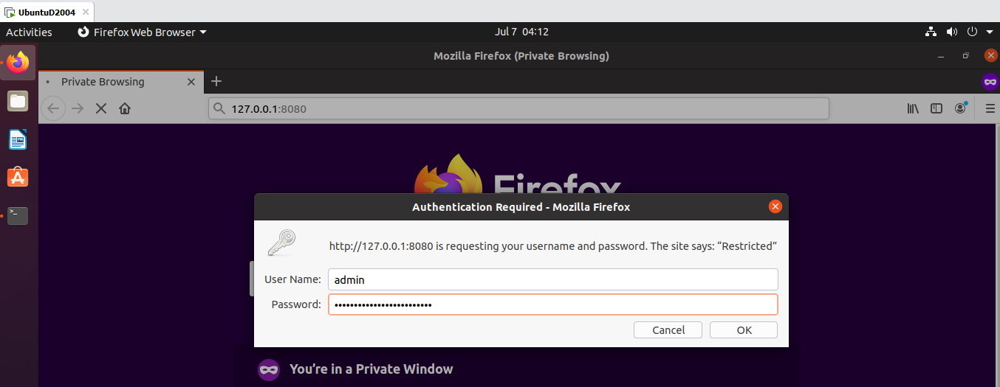
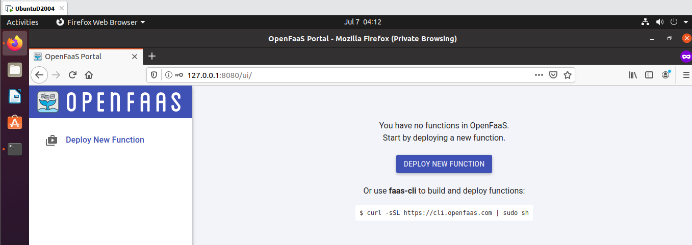

# Lab 1 - Prepare for OpenFaaS (Chuẩn bị cho OpenFaaS)

Yêu cầu của Lab:
- Cài đặt Docker, Kubernetes và OpenFaaS CLI
- Đăng nhập Docker Hub
- Cài đặt k3d, arkade
- Tạo được local cluster


## Cài đặt Docker

Thực hiện các bước ở đây https://github.com/tri105/docker-labs/tree/master/Install

## Cài đặt Kubernetes

Cài đặt `kubectl`

```
export VER=$(curl -s https://storage.googleapis.com/kubernetes-release/release/stable.txt)

curl -LO https://storage.googleapis.com/kubernetes-release/release/$VER/bin/linux/amd64/kubectl

chmod +x kubectl

mv kubectl /usr/local/bin/
```

Kiểm tra version

```
kubectl version
```

## Cài đặt OpenFaaS CLI

Gõ trên Terminal

```
curl -sLSf https://cli.openfaas.com | sudo sh
```

Kiểm tra version

```
faas-cli version
```

Cần trợ giúp?

```
faas-cli help
```

## Cấu hình Docker Hub

Trước tiên, bạn cần có tài khoản. Đăng ký ở đây: https://hub.docker.com

Đăng nhập Docker Hub trên Terminal

```
docker login

#//output
Password: 
WARNING! Your password will be stored unencrypted in /root/.docker/config.json.
Configure a credential helper to remove this warning. See
https://docs.docker.com/engine/reference/commandline/login/#credentials-store

Login Succeeded
```

Cấu hình prefix để tự upload image khi có image mới. Sửa `~/.bashrc` hoặc `~/.bash_profile`

```
export OPENFAAS_PREFIX="docker-hub-username"
```

## Tạo một cluster Kubernetes

Sẽ có một gateway dạng `http://gateway:8080` hoặc `http://gateway.openfaas:8080`

**- Tạo local cluster bằng k3s**

*k3s (trong k3d). Cài đặt k3d*

```
curl -s https://raw.githubusercontent.com/rancher/k3d/master/install.sh | bash
```

Tham khảo thêm ở đây https://github.com/rancher/k3d


**- Tạo mới cluster**

```
k3d create

#//output
INFO[0000] Created cluster network with ID c30f7412e70a3ca751e8f93b5786f01232fe98a1ae2a8cd95545c6ba90e16f07 
INFO[0000] Created docker volume  k3d-k3s-default-images 
INFO[0000] Creating cluster [k3s-default]               
INFO[0000] Creating server using docker.io/rancher/k3s:v1.17.3-k3s1... 
INFO[0000] Pulling image docker.io/rancher/k3s:v1.17.3-k3s1... 
```

Phải thêm file config k3d vào bằng

```
export KUBECONFIG="$(k3d get-kubeconfig --name='k3s-default')"
```

## Deploy OpenFaaS

**- Chạy OpenFaaS bằng `arkade`**

Cài arkade

```
curl -SLsf https://dl.get-arkade.dev/ | sudo sh
```

Chạy ứng dụng OpenFaaS

```
arkade install openfaas

#//output
Using kubeconfig: /root/.config/k3d/k3s-default/kubeconfig.yaml
Using helm3
Node architecture: "amd64"
Client: "x86_64", "Linux"
2020/07/07 01:22:58 User dir established as: /root/.arkade/
https://get.helm.sh/helm-v3.1.2-linux-amd64.tar.gz
/root/.arkade/bin/helm3/linux-amd64 linux-amd64/
/root/.arkade/bin/helm3/helm linux-amd64/helm
/root/.arkade/bin/helm3/README.md linux-amd64/README.md
/root/.arkade/bin/helm3/LICENSE linux-amd64/LICENSE
2020/07/07 01:23:07 extracted tarball into /root/.arkade/bin/helm3: 3 files, 0 dirs (6.7577798s)
"openfaas" has been added to your repositories

Hang tight while we grab the latest from your chart repositories...
...Successfully got an update from the "openfaas" chart repository
Update Complete. ⎈ Happy Helming!⎈ 
VALUES values.yaml
Command: /root/.arkade/bin/helm3/helm [upgrade --install openfaas openfaas/openfaas --namespace openfaas --values /tmp/charts/openfaas/values.yaml --set serviceType=NodePort --set clusterRole=false --set gateway.directFunctions=true --set basicAuthPlugin.replicas=1 --set queueWorker.replicas=1 --set queueWorker.maxInflight=1 --set basic_auth=true --set operator.create=false --set openfaasImagePullPolicy=IfNotPresent --set faasnetes.imagePullPolicy=Always --set gateway.replicas=1 --set ingressOperator.create=false]
Release "openfaas" does not exist. Installing it now.
NAME: openfaas
LAST DEPLOYED: Tue Jul  7 01:23:20 2020
NAMESPACE: openfaas
STATUS: deployed
REVISION: 1
TEST SUITE: None
NOTES:
To verify that openfaas has started, run:

  kubectl -n openfaas get deployments -l "release=openfaas, app=openfaas"
=======================================================================
= OpenFaaS has been installed.                                        =
=======================================================================

# Get the faas-cli
curl -SLsf https://cli.openfaas.com | sudo sh

# Forward the gateway to your machine
kubectl rollout status -n openfaas deploy/gateway
kubectl port-forward -n openfaas svc/gateway 8080:8080 &

# If basic auth is enabled, you can now log into your gateway:
PASSWORD=$(kubectl get secret -n openfaas basic-auth -o jsonpath="{.data.basic-auth-password}" | base64 --decode; echo)
echo -n $PASSWORD | faas-cli login --username admin --password-stdin

faas-cli store deploy figlet
faas-cli list

# For Raspberry Pi
faas-cli store list \
 --platform armhf

faas-cli store deploy figlet \
 --platform armhf

# Find out more at:
# https://github.com/openfaas/faas

Thanks for using arkade!
```

**- Đăng nhập vào OpenFaaS gateway**

```
kubectl rollout status -n openfaas deploy/gateway

kubectl port-forward -n openfaas svc/gateway 8080:8080 &
```

> Tips: để ra khỏi local chỉ cần chỉnh lại port-forward và IP cần ra

```
kubectl port-forward -n openfaas  --address localhost,<your-ip> svc/gateway 8080:8080 &
```

Gateway URL : http://127.0.0.1:8080

**- Lấy mật khẩu để đăng nhập**

```
PASSWORD=$(kubectl get secret -n openfaas basic-auth -o jsonpath="{.data.basic-auth-password}" | base64 --decode; echo)

faas-cli login --username admin --password=$PASSWORD

echo $PASSWORD
```





**Kiểm tra danh sách function**

```
faas-cli list
```

## Cấu hình OpenFaaS URL

Sửa ~/.bashrc hoặc ~/.bash_profile

```
export OPENFAAS_URL="your-url"
```

Ví dụ: http://127.0.0.1:8080

## Tham khảo lệnh từ https://kubernetes.io/docs/reference/generated/kubectl/kubectl-commands

Hoàn thành! Qua [lab2](../Lab2/)