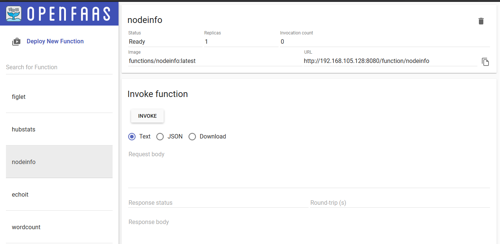
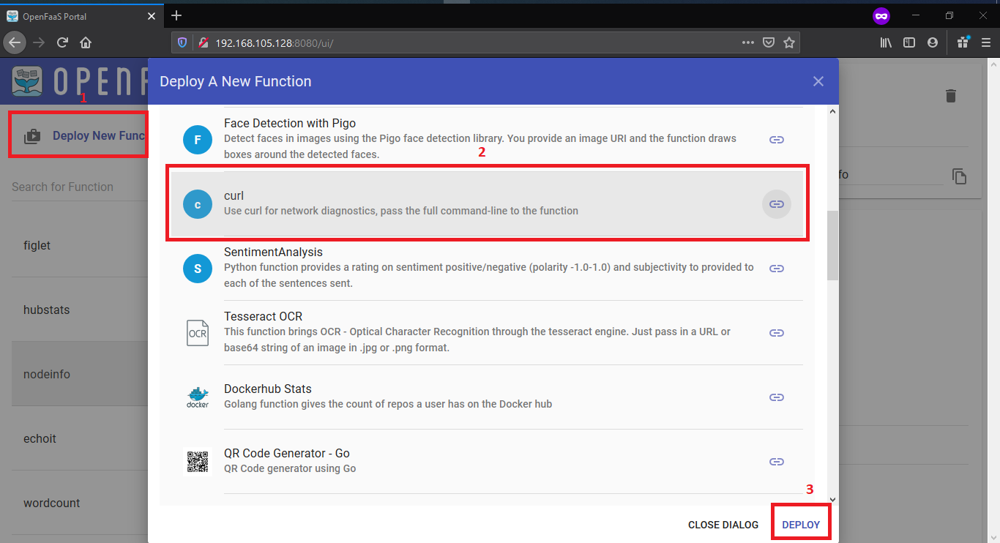
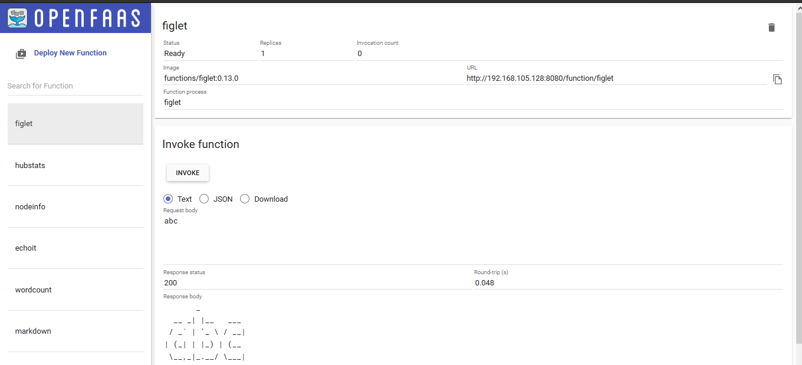
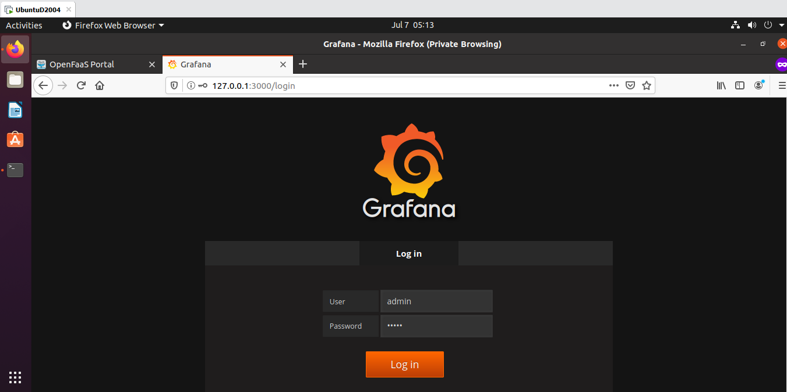
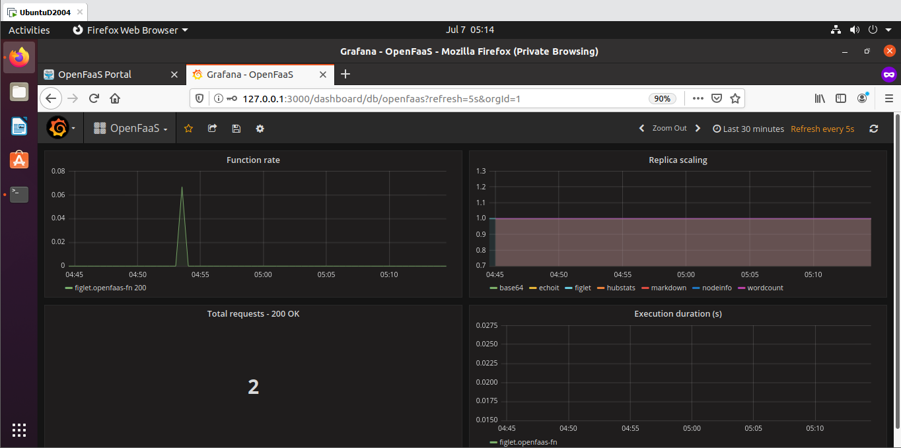

# Lab 2 - Test things out (Thử nghiệm)

Yêu cầu bài Lab:
- Tìm hiểu cách dùng giao diện OpenFaaS (OpenFaaS UI Portal)
- Invoke một function bằng 2 cách: trên UI và trên CLI
- Theo dõi các chỉ số qua Prometheus và Grafana

Trước khi vào bài, hãy tạo một thư mục chứa Lab2

```
mkdir -p lab2 && cd lab2
```

## Deploy function

**- Sử dụng UI Portal**

Truy cập địa chỉ mặc định OpenFaaS Portal: http://127.0.0.1:8080



Thử deploy một số hàm có sẵn theo đường dẫn sau

```
faas-cli deploy -f https://raw.githubusercontent.com/openfaas/faas/master/stack.yml
```

**- Sử dụng Store**



## Invoke a function

**- Sử dụng UI Portal**



**- Sử dụng CLI**

Kiểm tra danh sách function đang có

```
faas-cli list
```

Hoặc

```
faas-cli list -v
```

Với `-v` là `--verbose` ta có thể thấy thêm Docker image cùng với tên function

```
faas-cli invoke markdown
```

Nhập `text` và ấn `Ctrl + D` để dừng

Hoặc ta có thể dùng lệnh đường ống (Pipeline)

```
echo Hi | faas-cli invoke markdown

uname -a | faas-cli invoke markdown
```

## Monitoring dashboard

Prometheus đảm nhiệm vai trò thu thập dữ liệu và dùng Grafana để hiển thị dạng biểu đồ

Chạy các lệnh

```
kubectl -n openfaas run --image=stefanprodan/faas-grafana:4.6.3 grafana

kubectl -n openfaas create deploy --image=stefanprodan/faas-grafana:4.6.3 grafana

kubectl -n openfaas expose deployment grafana --type=NodePort --port=3000 --name=grafana

kubectl port-forward --address localhost,<your-ip> deployment/grafana 3000:3000 -n openfaas &
```

Grafana URL mặc định là: http://127.0.0.1:3000



Dùng tài khoản mặc định của Grafana: `admin/admin`



Hoàn thành! Qua [lab3](../Lab3/)